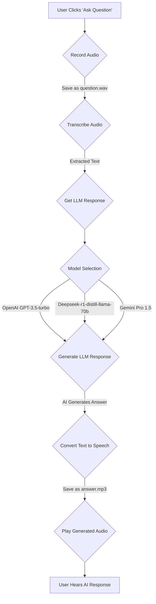

<h1 align="center">Voice Chatbot (Multi-Model)</h1>

<div align="justify">
  
## Introduction

The **Voice Chatbot (Multi-Model)** is an advanced voice-enabled conversational AI system built using Streamlit. It allows users to ask questions via voice input, transcribes the speech into text using OpenAI's Whisper model, generates intelligent responses using multiple large language models (LLMs), and finally converts the response into speech for playback. This system seamlessly integrates speech recognition, text-based AI processing, and text-to-speech synthesis into a single interactive user experience.

## Features

- **Multi-Model Support**: Users can choose from different LLMs including OpenAI GPT-3.5-turbo, Deepseek-r1-distill-llama-70b, and Gemini Pro 1.5.
- **Voice-Based Input**: Users can record their voice to interact with the chatbot.
- **Automated Speech Recognition (ASR)**: Converts recorded audio into text using OpenAI's Whisper model.
- **AI-Powered Text Responses**: The chatbot processes user input and generates responses based on the selected model.
- **Text-to-Speech (TTS) Conversion**: Converts AI-generated text responses into speech for playback.
- **Intuitive User Interface**: A clean and user-friendly interface built with Streamlit.

## Technologies Used

- **Streamlit**: For building the web-based user interface.
- **OpenAI Whisper**: For accurate speech-to-text transcription.
- **OpenAI GPT-3.5-turbo**: For generating intelligent responses.
- **Deepseek-r1-distill-llama-70b**: An alternative LLM for response generation.
- **Gemini Pro 1.5**: Another LLM option for generating responses.
- **OpenAI's TTS**: For converting text responses into speech.

## User Interface

The chatbot features an elegant and minimalistic interface, allowing users to easily interact with the system. The sidebar enables users to select an LLM, while the main interface handles the conversation flow. The recorded user query is displayed, followed by the AI-generated response and an embedded audio player for playback.


## System Workflow

The system follows a structured workflow for processing voice inputs, generating AI responses, and providing audio output.  

<p align="center">
  
</p>

The chatbot operates through a structured pipeline to ensure seamless execution from input to output. Below is a step-by-step breakdown of its workflow:

1. **User Interaction**
   - The user initiates the interaction by clicking the **Ask Question** button.

2. **Audio Recording**
   - The chatbot records the user’s voice input for five seconds.
   - The recorded audio is saved as `audio/question.wav`.

3. **Speech-to-Text Conversion**
   - The system transcribes the recorded audio into text using OpenAI's Whisper model.
   - The transcribed text is displayed in the interface.

4. **Processing AI Response**
   - The chatbot processes the transcribed text using the selected LLM.
   - The AI model generates an intelligent response based on the user’s query.
   - The response is displayed in the interface.

5. **Text-to-Speech (TTS) Synthesis**
   - The AI-generated response is converted into speech using OpenAI's TTS capabilities.
   - The synthesized speech is saved as `audio/answer.mp3`.

6. **Audio Playback**
   - The chatbot plays back the synthesized response using an embedded audio player.
   - The user listens to the chatbot’s verbal response.

## Flowchart Representation

To visualize the entire process, the workflow is represented using a structured flowchart.



## Installation and Setup

To run the chatbot locally, follow the steps below.

### Prerequisites

Ensure you have the following installed on your system:

- Python 3.8 or higher
- Required dependencies listed in `requirements.txt`

### Installation Steps

1. **Clone the repository**:
   ```sh
   git clone https://github.com/harshit4032/Voice-Bot.git
   ```
2. **Navigate to the project directory**:
   ```sh
   cd Voice-Bot
   ```
3. **Install the dependencies**:
   ```sh
   pip install -r requirements.txt
   ```

### API Key Configuration

This application utilizes OpenAI's API for transcription and text-to-speech services. To configure the API key:

1. **Obtain an OpenAI API Key**: Sign up at [OpenAI's website](https://openai.com/) and generate an API key.
2. **Set the API Key as an Environment Variable**:
   - On macOS/Linux:
     ```sh
     export OPENAI_API_KEY='your-api-key-here'
     ```
   - On Windows:
     ```sh
     set OPENAI_API_KEY='your-api-key-here'
     ```

Alternatively, you can set the API key directly in your Python script:

```python
import os
os.environ["OPENAI_API_KEY"] = 'your-api-key-here'
```

**Note**: Ensure that your API key is kept secure and not exposed in public repositories.

### Running the Application

Once the setup is complete, start the chatbot by running the command:

```sh
streamlit run app.py
```

This will launch the chatbot in a web browser where you can interact with it using voice commands.

## Contributing

Contributions are welcome! If you have suggestions for improvements or want to add new features, feel free to open an issue or submit a pull request. Ensure that your contributions align with the project’s goals and maintain code quality standards.


## Acknowledgments

- **OpenAI**: For providing powerful language models and TTS capabilities.
- **Google DeepSeek**: For advanced LLM solutions.
- **Streamlit**: For enabling easy UI development.
- **Whisper**: For state-of-the-art speech recognition.

This project aims to make voice-enabled AI interactions seamless and accessible. Feel free to explore, modify, and enhance its capabilities.
</div>
